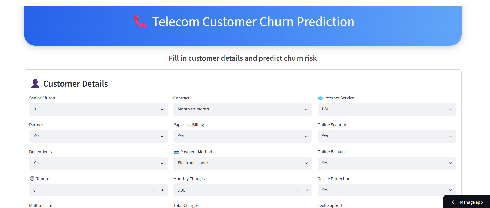
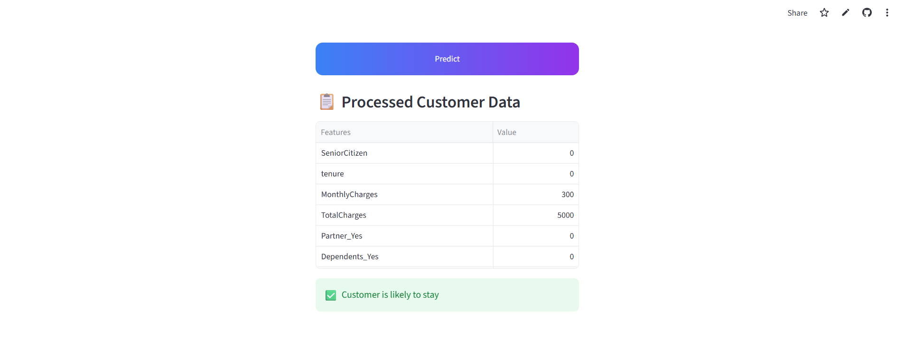
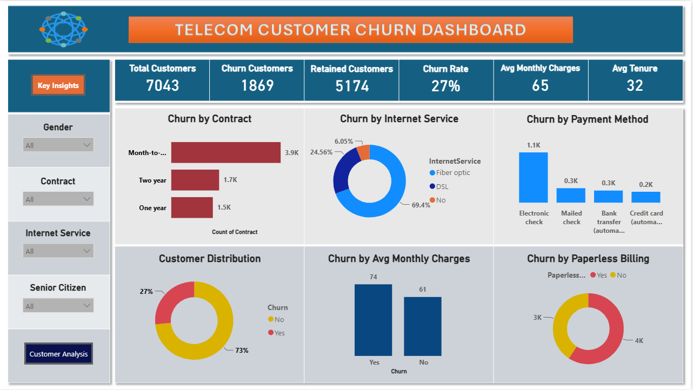
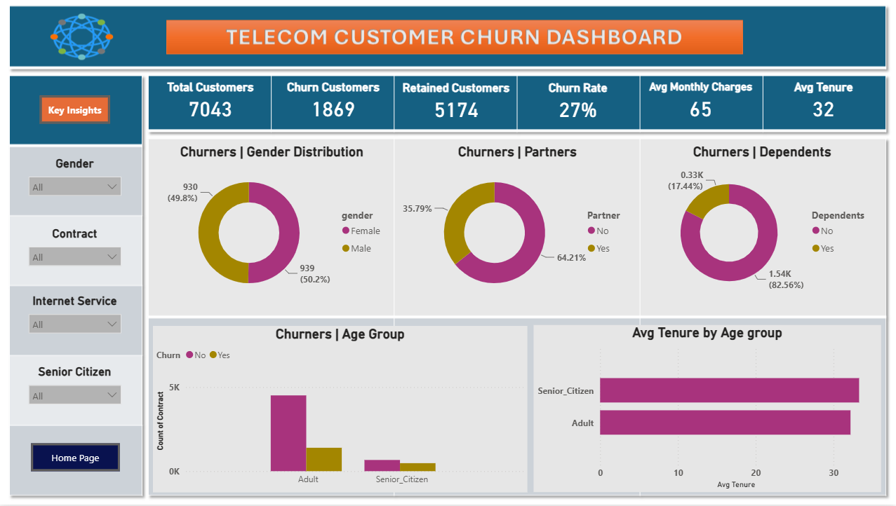
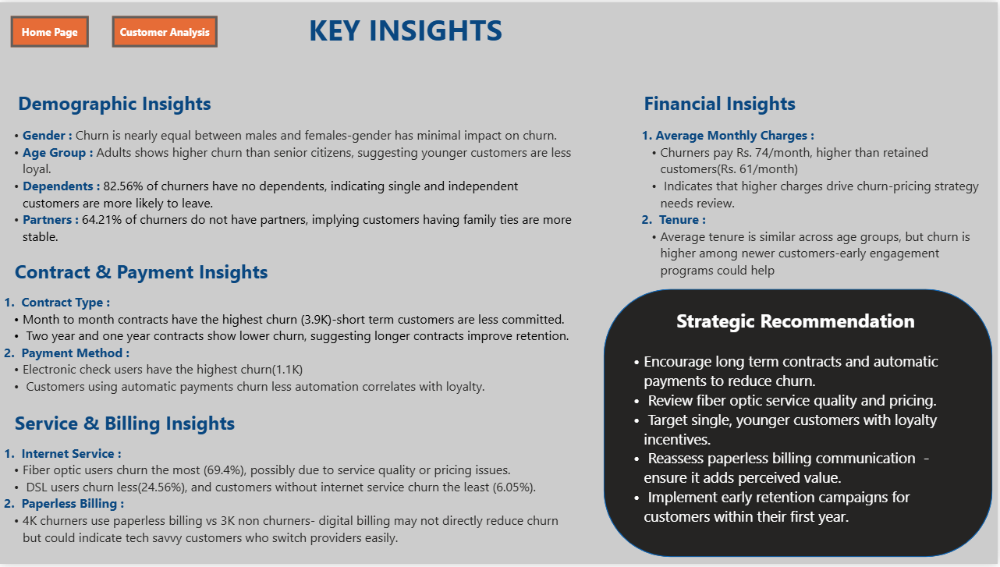

# Telecom_Customer_Churn_Prediction

## Project Overview
Customer churn is a major challenge in the telecom industry, as losing existing customers directly impacts business revenue and increases customer acquisition costs. This project develops an end-to-end machine learning solution to predict whether a customer is likely to churn based on demographic information, subscribed services, billing details, and customer account information.

The final solution includes data preprocessing, exploratory data analysis (EDA), feature engineering, model comparison, evaluation, and deployment using Streamlit.

## Problem Statement
The objective of this project is to build a machine learning model capable of predicting customer churn so that telecom companies can proactively identify customers at high risk of leaving and implement effective retention strategies.

## Dataset
* Dataset: Telco Customer Churn Dataset
* Source: Kaggle
* Records: 7,043
* Features: 21 (before preprocessing)
* Target Variable: Churn (Yes / No)

## Technologies Used
* Python
* Pandas
* NumPy
* Matplotlib
* Seaborn
* Scikit-learn
* Imbalanced-learn (SMOTE)
* Streamlit
* Joblib

## Project Workflow
1. Data Collection
2. Data Cleaning
3. Exploratory Data Analysis (EDA)
4. Feature Engineering
5. Data Encoding
Feature Scaling
Model Training
Model Evaluation
Streamlit Deployment

## Exploratory Data Analysis
Key visualizations performed:

Customer Churn Distribution
Contract Type vs Churn
Internet Service vs Churn
Monthly Charges Distribution

## Key Insights
Customers with month-to-month contracts are more likely to churn.
Fiber optic customers showed higher churn rates.
Longer contract durations significantly reduced churn.
Monthly charges influenced customer retention.

## Machine Learning Models
The following classification algorithms were trained and evaluated:

Logistic Regression
Decision Tree Classifier
Random Forest Classifier
Support Vector Classifier (SVC)
K-Nearest Neighbors (KNN)

## Handling Class Imbalance
The target variable showed moderate class imbalance.

To analyze its impact, all models were trained under two scenarios:

Without SMOTE
With SMOTE

After evaluation, models trained without SMOTE achieved better overall performance. Therefore, the original dataset was used for the final model.

## Final Selected Model
#### Logistic Regression

Reason for selection:

* Highest prediction accuracy
* Better generalization
* Stable performance
* Efficient deployment

## Deployment
The trained model was deployed using Streamlit.

##### Application Features
* Interactive user interface
* Real-time churn prediction
* Automatic preprocessing
* Dynamic feature encoding
* Responsive layout

## Project Screenshots

#### Streamlit Home Page

#### Prediction Output

#### Dashboard

## Business Impact
This solution enables telecom companies to:

* Identify customers at risk of churn
* Improve customer retention strategies
* Support data-driven business decisions
* Reduce customer acquisition costs
* Increase long-term profitability

